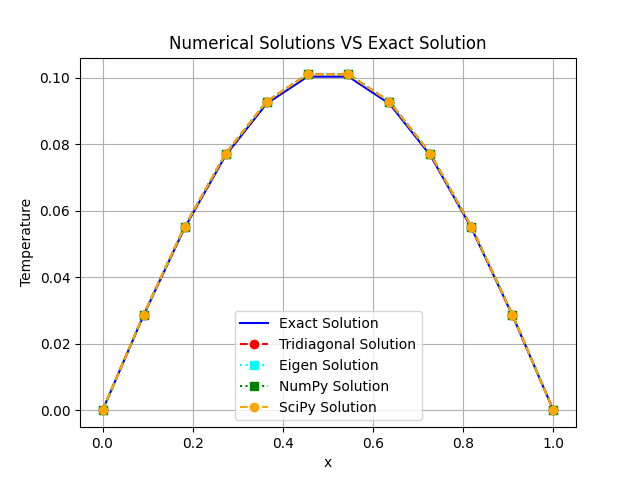

# Thomas Algorithm for heat diffusion problem

The instructions for this exam project can be found [here](https://github.com/pcafrica/advanced_programming_2023-2024/blob/main/exams/2024-02-13/part2.md) or in the previous folder.

## Code organization
A module called moduleH is created using the header, template and source files in the folder MatrixModule; the main file is in the folder called main; a CMake and a setup.py are provided and will be explained later on. When executing the main, a folder `images` containing a plot is created.

## Implementation of Matrix
This class implements an abstract class Matrix and its derived classes TridiagonalMatrix and EigenMatrix. The abstract class defines common matrix attributes and pure virtual methods, such as getting the dimension, accessing elements, printing the matrix, getting each diagonal.<br>
The access of elements is done overloading the `operator()` that in PyBind will be called readMatrixEntry. While for the TridiagonalMatrix it is overloaded as one would expect, for EigenMatrix it uses an already existing method of Eigen called `.coeff()` that gets applied to the constructed SparseMatrixXd. SparseMatrixXd is implemented in the constructor, using the method `.insert(row,column)` of Eigen to inserting the diagonal values in the matrix.<br>
Having used a SparseMatrix, it would have made sense to actually compress it, but it was not considered fundamental to the development of the project. In fact it could have been used to print it in a compressed way, but as most people are more used to seeing a matrix in a dense way, it was not done.<br>
Both methods for printing the matrix use the overloaded operator() to access elements instead of cycling through rows and columns, being less time and energy consuming.<br>
Both solve methods call the Thomas algorithm to solve it, without any explicit call to HeatDiffusion; the reason for this choice will be explained in the next section.

## Implementation of ThomasSolver
ThomasSolver is a class templated over the matrix type - thus it is defined in a template file with extension .tpl.hpp - to allow to work with any matrix type; here TridiagonalMatrix and Eigen's SparseMatrixXd.<br>
It implements the Thomas algorithm which is an algorithm to solve tridiagonal systems of equations. The implementation does not assume anything specific about the matrix type, it just needs its diagonal vectors.<br>
For this reason it can not only be used to solve the heat diffusion problem as required by the instructions of the project, but it can solve any tridiagonal system of equations. A proof of it is given in the second part of the main, solving a system given a matrix 5x5 and a right-hand vector.

## Implementation of HeatDiffusion
This class represents the heat diffusion problem and exposes its relevant parameters (domain, boundary conditions, forcing term f).
With these parameters, the right-hand side vector $f$ is computed starting from a function of x. In fact muParserX is used to parse the functions and the exact results from input strings. The exact result is used when validating the computed solution against the exact solution.<br>
For testing them in the main, both the heat source term $f(x) = \sin(\pi x)$ and the exact analytical solution
```math
u_\mathrm{ex}(x) = \frac{\sin(\pi x)}{\pi^2}.
```
are provided, together with the domain $[0,L] = [0,1]$, the boundary conditions $\alpha = \beta = 0$ and the heat tridiagonal matrix A that solves the system `Au=f` where
```math
A = \begin{bmatrix}
1 & 0 & 0 & \cdots & \cdots & \cdots & \cdots & 0\\
-1 & 2 & -1 & 0 & & & & \vdots\\
0 & -1 & 2 & -1 & \ddots & & & \vdots\\
\vdots & 0 & \ddots & \ddots & \ddots & \ddots & & \vdots\\
\vdots & & \ddots & \ddots & \ddots & \ddots & 0 & \vdots\\
\vdots & & & \ddots & -1 & 2 & -1 & 0\\
\vdots & & & & 0 & -1 & 2 & -1\\
0 & \cdots & \cdots  & \cdots & \cdots & 0 & 0 & 1\\
\end{bmatrix},
\quad
\mathbf{u} = \begin{bmatrix}
u_0 \\
u_1 \\
\vdots \\
u_{N+1}
\end{bmatrix},
\quad
\mathbf{f} = \begin{bmatrix}
\alpha \\
f(x_1) h^2 \\
f(x_2) h^2 \\
\vdots \\
f(x_N) h^2 \\
\beta
\end{bmatrix}.
```
The diagonals of this matrix are the diagonal vectors a, b, c defined in each Matrix constructor. For computing them and the heat source term, the methods `setHeatMatrix` and `computeHeatSource` are called in the main when solving the heat diffusion problem.

## Validation of solutions and considerations
In the first part of the main, the above heat diffusion problem is solved using four methods: the TridiagonalMatrix and EigenMatrix implemented in C++ and the already existing functions `solve` from `numpy.linalg` and `solve_banded` from `scipy.linalg`. Every method is decorated with a time wrapper so to confront their execution times. Every solution is validated against the exact solution computing the error $\left\|u - u_\mathrm{ex}\right\|$ in Euclidean norm.<br>
As it can be seen from this plot that compares the numerical and exact solutions VS x, all the results perfectly coincide.
<p align="center">
  <br>
 Numerical Solutions VS Exact Solution
</p>

> [!TIP]
> A helpful tip in case one wants to reproduce the results: define a HeatDiffusion object each time in the main.

In fact I had not done it and I was wondering why the Eigen plot and solution were exactly specular to the Tridiagonal ones: solving the heat problem somehow modifies the HeatDiffusion instance thus, having first defined the Tridiagonal one, when later using the Eigen, it starts from opposite values.<br>
The second part of the main is similar to the first one. Wanting to test the Thomas algorithm on a generic tridiagonal matrix outside the heat diffusion problem, I defined a 5x5 matrix, multiplied it by hand to a vector and gave the result to the program. All three compared methods return the original vector I multiplied the matrix with.

## CMake and libraries
A CMake for the creation of the modules is provided. Also a setup.py is provided, creating a Python package easily installable via pip.
Some Python packages were used: NumPy, SciPy, MatPlotLib, tabulate. They can be installed with `pip install [names] --user`.<br>
NumPy and SciPy are used for mathematical operations when comparing the results obtained with the self-implemented C++ code with already implemented Python functions; MatPlotLib is used for plotting the numerical and exact solutions vs x for a visual comparison; tabulate to create a table of some results.<br>
The library muParserX is used in `HeatDiffusion` in order to compute the heat source vector starting from a function of x. It can downloaded from [this zip file on GitHub](https://github.com/beltoforion/muparserx/archive/refs/tags/v4.0.12.tar.gz).<br>
The library Eigen is used in `Matrix` in order to define a SparseMatrixXd and using its methods `.insert` and `coeff()` instead of developing new ones. It can be downloaded from [the original webpage](https://eigen.tuxfamily.org/index.php?title=Main_Page). 
For installing both libraries, it's required to create a folder in which to run the cmake.  

## How to compile
A CMake and a setup.py are provided in the main directory. Setup.py implicitly calls CMake, thus everything is ready writing:
```bash
python setup.py install --user
```
Or even better just using pip
```bash
pip install --user .
```
Lastly, to compile the main:
```bash
python main/main.py
```
